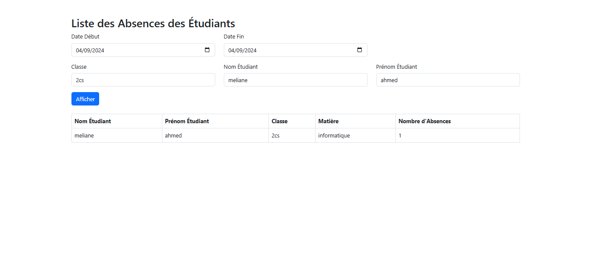
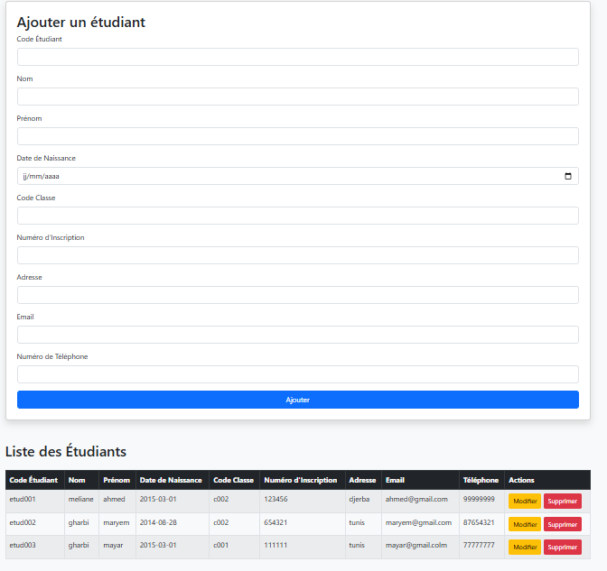
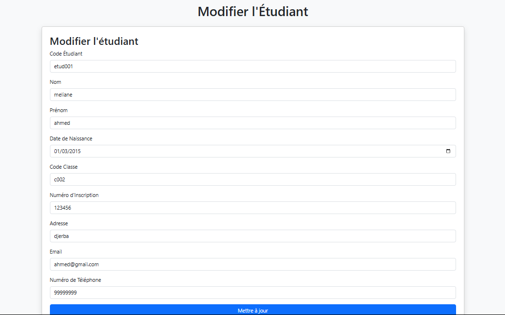
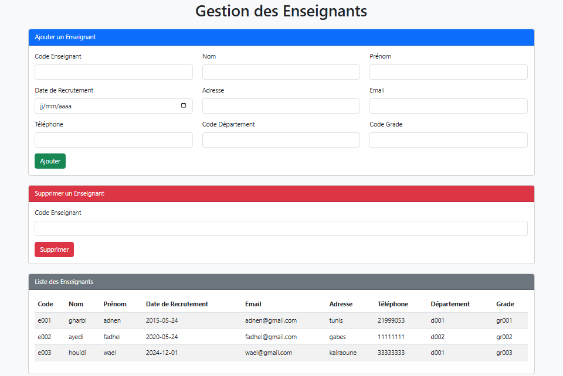
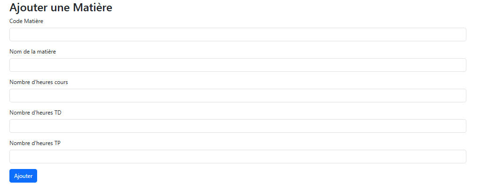
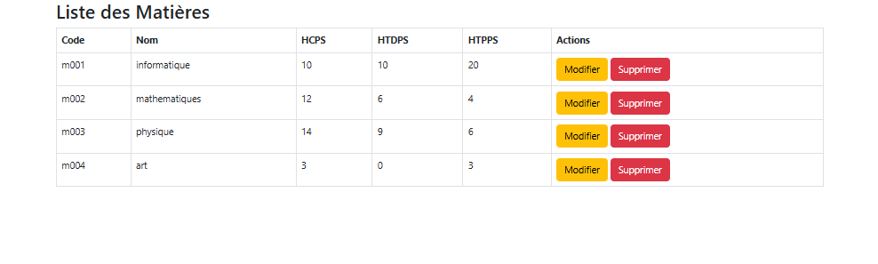

# **Student Management System**

A powerful **PHP-based Student Management System** designed to simplify the management of student records, classes, and attendance. This project demonstrates advanced PHP techniques, seamless database integration, and clean UI development using **Bootstrap**.

---

## **Table of Contents**
1. [Features](#features)
2. [Technologies Used](#technologies-used)
3. [Installation](#installation)
4. [Usage](#usage)
5. [Screenshots](#screenshots)
6. [Contributing](#contributing)
7. [License](#license)

---

## **Features**

- Add, edit, and delete student records.
- Manage class schedules and student enrollments.
- Attendance tracking system for students.
- User-friendly interface with Bootstrap integration.
- Built-in error handling for smooth operations.

---

## **Technologies Used**

- **PHP 8.x**  
   <br> Core back-end logic.

- **MySQL**  
   <br> Database for managing student data.

- **Bootstrap 5**  
   <br> Responsive and modern UI.

- **JavaScript**  
   <br> Enhances interactivity and form validation.

- **XAMPP**  
   <br> Local server environment for testing.

- **Git**  
   <br> Version control system.

---

## **Installation**

1. **Clone the repository:**
   ```bash
   git clone https://github.com/your-username/your-repository.git
   cd your-repository
   ```

2. **Set up the database:**
   - Import the `project_etudiant.sql` file into your MySQL database.

3. **Update the database configuration:**
   - Open the `config.php` file and set your database credentials:
     ```php
     define('DB_HOST', 'your_host');
     define('DB_NAME', 'your_database_name');
     define('DB_USER', 'your_username');
     define('DB_PASS', 'your_password');
     ```

4. **Start your local server:**
   - Use **XAMPP** or any other PHP server to host the project locally.

5. **Access the project:**
   - Open your browser and navigate to:
     ```
     http://localhost/your-project-folder/
     ```

---

## **Usage**

1. Navigate to the home page to view the student dashboard.
2. Use the **Add Student** form to register a new student.
3. Manage classes and attendance using the respective pages.
4. Edit or delete student records from the list.
5. Secure login ensures only authorized users can access the system.

---

## **Screenshots**

Below are some screenshots of the application to give you a visual overview:

### **Student Management**
- **Student Dashboard**  
    
  _The overview of the student’s details and actions._
  
- **Add New Student**  
    
  _The form to add a new student to the system._
  
- **Student Details**  
    
  _Detailed information of the student._

### **Professor Management**
- **Professor Overview**  
    
  _Manage professor data and assign classes._

### **Material Management**
- **Add New Material**  
    
  _Add new material for courses or lectures._
  
- **Material Details**  
    
  _Detailed view of educational material._


## **Contributing**

Contributions are welcome! Follow these steps to contribute:

1. Fork the repository.
2. Create a new branch:
   ```bash
   git checkout -b feature/your-feature
   ```
3. Commit your changes:
   ```bash
   git commit -m "Add your feature"
   ```
4. Push to your branch:
   ```bash
   git push origin feature/your-feature
   ```
5. Open a Pull Request.

---

## **License**

This project is licensed under the MIT License.

---

## **Contact Me**

Feel free to reach out if you have any questions or suggestions!

✉️ **Email**: [mohamed.rayen.gharbi2004@gmail.com](mailto:mohamed.rayen.gharbi2004@gmail.com)  

